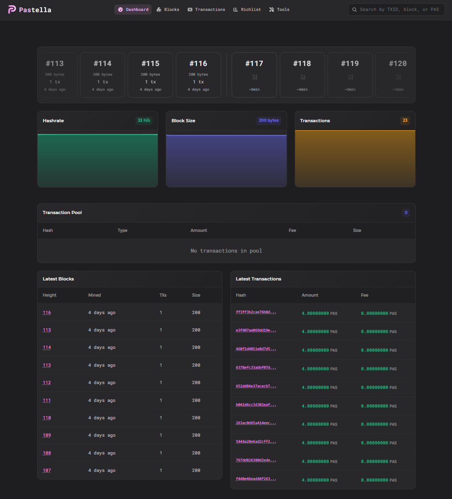

# Pastella Block Explorer



A modern, feature-rich blockchain explorer for Pastella (PAS). Built with React, TypeScript, and Vite, this explorer provides real-time blockchain data visualization, wallet tracking, and advanced features including an integrated wallet generator.

## Table of Contents

- [Features](#features)
  - [Core Explorer Functionality](#core-explorer-functionality)
  - [Advanced Features](#advanced-features)
  - [Technical Specifications](#technical-specifications)
- [Technology Stack](#technology-stack)
  - [Frontend](#frontend)
  - [Cryptography](#cryptography)
  - [Development Tools](#development-tools)
- [Installation](#installation)
  - [Prerequisites](#prerequisites)
  - [Steps](#steps)
- [Building for Production](#building-for-production)
- [Configuration](#configuration)
- [Security Features](#security-features)
- [Browser Support](#browser-support)
- [API Requirements](#api-requirements)
- [Development](#development)
- [Contributing](#contributing)
- [License](#license)
- [Support](#support)
- [Acknowledgments](#acknowledgments)

## Features

### Core Explorer Functionality
- **Dashboard**: Real-time overview of network statistics, recent blocks, and transactions
- **Block Explorer**: Browse and search through all blocks in the blockchain
- **Transaction Explorer**: View detailed transaction information including inputs, outputs, and mixins
- **Wallet Tracking**: Search and monitor wallet addresses with complete transaction history
- **Staking Explorer**: Track staking deposits and rewards on the network
- **Richlist**: Track the wealthiest addresses on the network
- **Wallet Generator**: Built-in browser-based wallet creation tool
  - Generate secure Pastella wallets with Ed25519 keypairs
  - 25-word mnemonic seed support (Electrum wordlist)
  - Paper wallet export functionality
  - Private key and mnemonic display
  - Runs entirely client-side for maximum security

- **Network Status**: Real-time node monitoring and health checks

### Technical Specifications
- **Algorithm**: CryptoNote standard with Keccak-256 hashing
- **Curve**: Ed25519 for cryptographic operations
- **Address Format**: Na1 prefix with Base58 encoding
- **Mnemonic**: 25-word seed phrase with checksum validation

## Technology Stack

### Frontend
- React 19 with TypeScript
- Vite for fast development and building
- React Router for navigation
- Bootstrap 5 for responsive layout
- ApexCharts for data visualization
- FontAwesome for icons

### Cryptography
- @noble/ed25519 for Ed25519 curve operations
- @noble/hashes for Keccak-256 hashing
- js-sha3 for additional hash functions
- bs58 for Base58 encoding/decoding
- crc-32 for checksum calculations

### Development Tools
- ESLint for code quality
- TypeScript for type safety
- Vite Plugin Checker for real-time error reporting

## Installation

### Prerequisites
- Node.js 18.x or higher
- npm or yarn package manager

### Steps

1. Clone the repository:
```bash
git clone <repository-url>
cd pastella-explorer
```

2. Install dependencies:
```bash
npm install
```

3. Configure the explorer:
Edit `src/config/explorer.ts` to set your API endpoint and customize settings:
```typescript
export const config: Config = {
  api: 'http://your-api-endpoint:port',
  name: 'Pastella',
  ticker: 'PAS',
  // ... other configuration options
};
```

4. Start the development server:
```bash
npm run dev
```

The explorer will be available at `http://localhost:5173`

## Building for Production

1. Build the project:
```bash
npm run build
```

2. Preview the production build:
```bash
npm run preview
```

3. Deploy the `dist` folder to your web server or hosting provider.

## Configuration

The explorer can be customized through `src/config/explorer.ts`:

- **API Endpoint**: Configure your Pastella node API URL
- **Network Settings**: Adjust difficulty target, max supply, and fork heights
- **Pool Configuration**: Add or remove mining pools
- **Refresh Intervals**: Set how often data updates
- **Pagination**: Configure items per page

## Security Features

### Wallet Generator
- Runs entirely in the browser
- No data sent to servers
- Secure random number generation using Web Crypto API
- Mnemonic seed validation with checksum verification
- Private key never leaves the client

## Browser Support

- Chrome/Edge 90+
- Firefox 88+
- Safari 14+
- Opera 76+

## API Requirements

The explorer requires a running Pastella daemon with the block explorer API enabled.

Start your daemon with the following parameters:
```bash
Pastellad --rpc-bind-ip 0.0.0.0 --enable-blockexplorer --enable-blockexplorer-detailed --enable-cors "*"
```

Then update the API endpoint in `src/config/explorer.ts` to point to your daemon which needs to be public. Port 21001 needs to be forwarded (default: `http://localhost:21001`).

## Development

### Available Scripts
- `npm run dev` - Start development server
- `npm run build` - Build for production
- `npm run lint` - Run ESLint
- `npm run preview` - Preview production build

## Contributing

Contributions are welcome! Please ensure your code follows the project's ESLint rules and TypeScript conventions.

## License

This project is licensed under the MIT License.

## Support

For issues, questions, or suggestions, please open an issue on the project repository.

## Acknowledgments

- Built with React and Vite
- Cryptographic operations powered by @noble/ed25519
- UI components from Bootstrap 5
- Charts by ApexCharts
- Icons from FontAwesome
